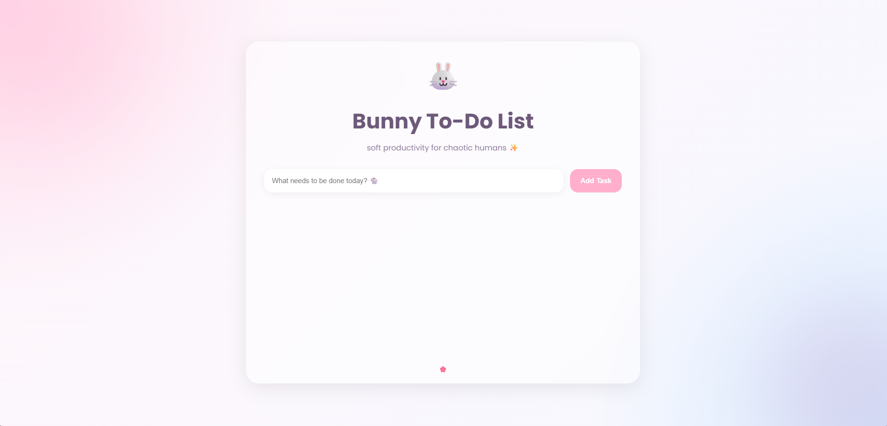
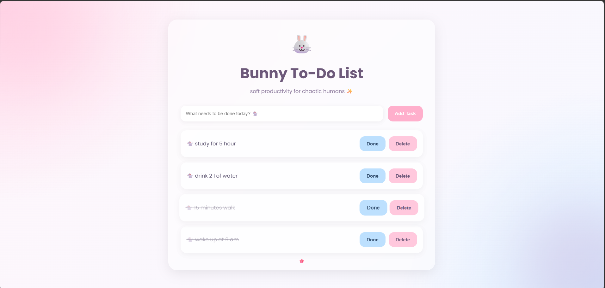

# 🐰 Bunny To-Do List

A modern and responsive task management web application built using HTML, CSS, and Vanilla JavaScript.

This project focuses on clean UI design, dynamic DOM manipulation, and interactive frontend functionality while following a structured and professional project architecture.

---

## 🔗 Live Demo

👉 [View Live Project](https://prachibagasi.github.io/to-do_list/)

---

##  Features

- Add new tasks dynamically
- Mark tasks as completed
- Delete tasks instantly
- Keyboard support using the `Enter` key
- Responsive full-screen layout
- Modern pastel-themed UI
- Smooth hover animations
- Glassmorphism-inspired design

---

## 🛠️ Tech Stack

### Frontend
- HTML5
- CSS3
- Vanilla JavaScript

### Concepts Used
- DOM Manipulation
- Event Handling
- Dynamic Element Creation
- CSS Flexbox
- Responsive Design
- JavaScript Functions

---

##  Screenshots

### Main Interface



### Task page



---

##  Project Structure

```bash
bunny-todo-app/
│
├── index.html
├── style.css
├── script.js
├── README.md
│
├── assets/
│   └── screenshots/
│       └── dashboard.png
│       └── tasks.png
|        
└── .gitignore
```

---

##  Getting Started

### Clone the Repository

```bash
git clone https://github.com/Prachibagasi/bunny-todo-app.git
```

### Navigate to the Project Folder

```bash
cd bunny-todo-app
```

### Run the Application

Open `index.html` in your browser.

---

##  Key Learning Outcomes

This project helped strengthen practical understanding of:

- Frontend development fundamentals
- Interactive UI implementation
- JavaScript event-driven programming
- Dynamic rendering using the DOM
- Responsive web design principles
- Clean project structuring

---

##  Future Improvements

- Local Storage integration
- Dark mode support
- Task editing functionality
- Drag and drop task sorting
- Due dates and priorities
- Backend integration
- User authentication
- Database support

---

##  Author

Prachi Bagasi
